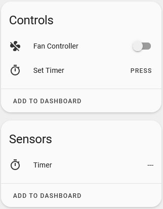
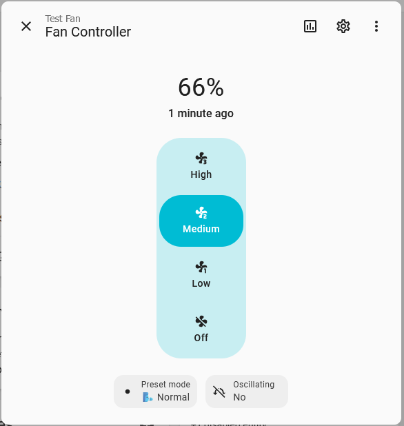

# 🌀 ESPHome Fan Component for BA8206 Controller

This is a custom ESPHome external component that implements the [fan component](https://esphome.io/components/fan/index.html) interface for fans using the BA8206 controller IC. The BA8206's control and status pins are interfaced through a PCF8575 GPIO expander, connected to an ESP8266 via I2C.

## ✨ Features

- Full fan control through ESPHome and Home Assistant
- Supports:
  - Power ON/OFF
  - Speed control (LOW, MEDIUM, HIGH)
  - Oscillation toggle
  - Preset modes (Sleep, Nature, Normal)
  - Timer (eg. 0.5h 1h 1.5h ...)
- Uses standard ESPHome `fan` platform
- Polls status LEDs for real-time feedback
- `independent_onoff` configuration for BA8206 chip variant which has independent On/Off button (seen on "K" chip variant).

## 🛠️ Hardware Requirements

- ESP8266 board (e.g., NodeMCU, Wemos D1 mini)
- PCF8575 I/O expander (connected via I2C)
- Physical access to BA8206-controller board of wall fan.
- Wiring as below diagram. 

## 🔌 Wiring Diagram

```text
ESP8266         PCF8575
---------       --------
GPIO4 (D2)  -->  SDA
GPIO5 (D1)  -->  SCL
Vin         -->  VCC
GND         -->  GND
```
```
BA8206           PCF8575
---------        --------
Pin (OFF)   -->  P07
Pin (TIMER) -->  P06
Pin (SPEED) -->  P05
Pin (MODE)  -->  P04
Pin (COM1)  -->  P03
Pin (COM2)  -->  P02
Pin (COM3)  -->  P01
Pin (SWING) -->  P00
```
```yaml
external_components:
  - source: components

i2c:
  sda: GPIO04
  scl: GPIO05
  scan: true
  id: bus_a
  frequency: 800kHz

fan:
  - platform: ba8206
    id: my_fan
    name: "Fan Controller"
    address: 0x20
    i2c_id: bus_a
    independent_onoff: true
```

## 🖼️ Screenshots




